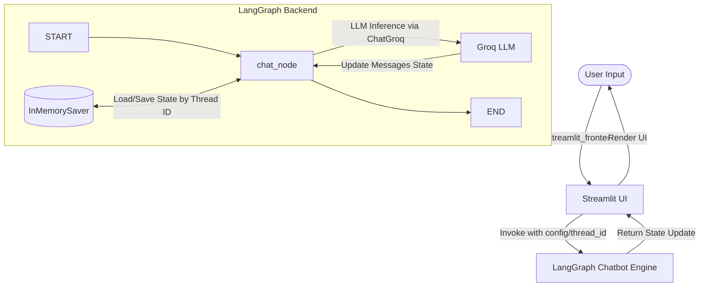

# 🧠 LangGraph Chatbot: Stateful Conversational Agent with Memory

[](https://www.python.org/)
[](https://github.com/langchain-ai/langgraph)
[](https://github.com/langchain-ai/langchain)
[](https://streamlit.io/)
[](https://groq.com/)

A stateful, memory-enabled AI chatbot built using **LangGraph**, **LangChain**, and **Groq** for high-speed LLM inference, served via an interactive **Streamlit** user interface. 

This repository showcases a modular architecture separating the state machine backend (agent logic) from the web presentation layer, serving as a clean template for production-grade agentic workflows.

---

## 🛠️ Architecture & Core Concepts

Unlike traditional linear chains, this application utilizes **LangGraph** to model the conversation as a state machine. This approach allows developers to easily scale the chatbot into a complex multi-agent system with conditional routing, tool calling, and human-in-the-loop validation.



### Key Engineering Highlights
* **State Management (`StateGraph`)**: Messages are stored in a centralized `Chatstate` typed dictionary. The graph processes input updates and tracks messages history seamlessly using LangGraph's `add_messages` annotator.
* **Thread-Specific Checkpointing (`InMemorySaver`)**: An in-memory checkpointer saves the state of the chatbot. By utilizing a configuration dictionary with a distinct `thread_id`, the system retains conversation context and memory across independent sessions.
* **Decoupled Architecture**: 
  - **Backend (`langgraph_backend.py`)**: Defines nodes, edges, state schema, and LLM initializations.
  - **Frontend (`streamlit_frontend.py`)**: Handles the user interface, session state rendering, and user input capture.

---

## 📂 Project Structure

```bash
├── langgraph_backend.py     # Core LangGraph agent configuration & compiled graph
├── streamlit_frontend.py    # Streamlit chat interface & UI session state wrapper
├── test_groq.py             # Diagnostic script to list and verify Groq models
├── requirements.tx          # Python dependency list
└── .env                     # Local environment variables (API Keys)
```

---

## 🚀 Getting Started

Follow these steps to run the chatbot locally:

### 1. Prerequisites
Ensure you have Python 3.9+ installed and a Groq API Key. Get your API Key from the [Groq Console](https://console.groq.com/).

### 2. Clone and Setup Environment
Clone the repository and create a virtual environment:
```bash
# Navigate to the workspace
cd LangGraph-Chatbot

# Create a virtual environment
python -m venv env

# Activate the virtual environment
# On Windows:
.\env\Scripts\activate
# On macOS/Linux:
source env/bin/activate
```

### 3. Install Dependencies
Install the required Python modules from `requirements.tx`:
```bash
pip install -r requirements.tx
```

### 4. Configure Environment Variables
Create a `.env` file in the root directory:
```env
GROQ_API_KEY=your_actual_groq_api_key_here
```

### 5. (Optional) Test Groq Integration
Verify that your API key is correctly configured and list available models:
```bash
python test_groq.py
```

### 6. Run the Chatbot
Launch the Streamlit web application:
```bash
streamlit run streamlit_frontend.py
```

---

## 🧠 Technology Stack

* **[LangGraph](https://langchain-ai.github.io/langgraph/)**: For building stateful, multi-actor applications with LLMs.
* **[LangChain Groq](https://github.com/langchain-ai/langchain-decisions)**: Integration library to invoke Groq's high-speed inference endpoints.
* **[Streamlit](https://streamlit.io/)**: A powerful framework for creating quick, interactive web interfaces for data science and AI applications.
* **[python-dotenv](https://github.com/theofidry/django-dotenv-config)**: For secure management of application configurations via environment variables.

---

## 📈 Future Roadmap

- [ ] **Persistent Storage**: Replace `InMemorySaver` with `SqliteSaver` or Postgres checkpointer to persist chat history across server restarts.
- [ ] **Tool Calling**: Introduce external API integrations (e.g., search, database queries) as graph nodes.
- [ ] **Conditional Routing**: Route conversations to specialized agent nodes dynamically based on user intent.
- [ ] **Multi-Thread Support**: Expose a Streamlit sidebar to switch between different `thread_id` sessions.

---

## 🤝 Connect with Me

* **GitHub**: [github.com-account](https://github.com/victorjanni)
* **LinkedIn**: [linkedin.com-account](https://www.linkedin.com/in/victor-janni-0634b41a0/)

